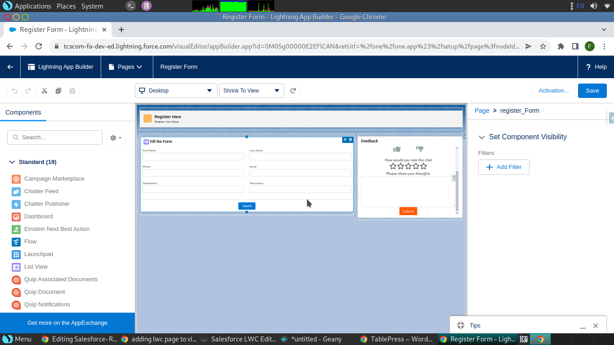
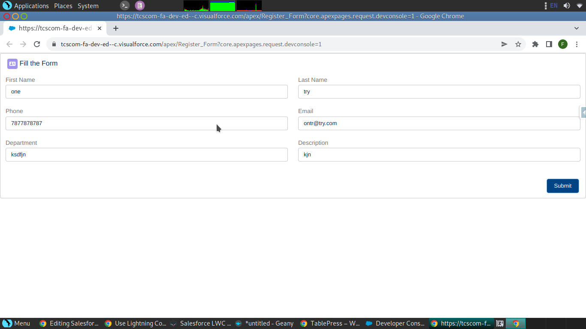

# Salesforce-LWC (Lightning Web Component)

> ### If you are new to salesforce, please complete Basics of Salesforce [Start with Salesforce](https://github.com/Hashichemnad/Salesforce-Rest-Api/)

## Section One:

- [ ] Setting up Environment.
  - You can start creating LWC through VSCode or Thirdparty IDE/Chrome Extension
  - Follow Either Method to setup your working Envirnment/IDE
    - VSCode - https://trailhead.salesforce.com/content/learn/projects/quick-start-lightning-web-components
    - Chrome Extension (Salesforce LWC Editor) - https://chrome.google.com/webstore/detail/salesforce-lwc-editor/ehkpneicmpbdejpoancidgkejlkahjgo
    

## Section Two:

  - [ ] HTML
    - https://youtu.be/cLeUejh3ZsM
    
  - [ ] JavaScript
    - https://youtu.be/JjWmbOXc0BA
    - https://youtu.be/-yQD3MmuS-c
    - https://trailhead.salesforce.com/content/learn/modules/javascript-essentials-salesforce-developers
    - https://trailhead.salesforce.com/content/learn/modules/modern-javascript-development
    
  - [ ] CSS
    - https://youtu.be/g1mN2z4wPNA
    
    
## Section Three:

  - [ ] Start with LWC
    - https://trailhead.salesforce.com/en/content/learn/trails/build-lightning-web-components
     
  - [ ] Training Videos
    - https://youtu.be/KQKFtR3NxEI
    - https://youtu.be/rODp-BoT_xs
    - https://youtu.be/knVr45N_peY
    - https://youtu.be/1zM_9i6qezY
    
  - [ ] Sample Projects Handson
    - https://trailhead.salesforce.com/content/learn/projects/lwc-build-flexible-apps

> - Select a simple project topic before starting Section 4.
> - Prepare DB Structure , Objects & Fields , Flow Diagram , Api details , Simple UI
> - Topic EX : Library Management, Online Book Selling, Vehicle rental, Travel agency

## Section Four

  - [ ] Create Header Component
    - [Html](./header.html)
    
  - [ ] Create Form Component
    - [Html](./Register_Form.html)
    - [JS](./Register_Form.js)

  - [ ] Create a Lightning Page and Add both components
    - Go to Setup -> Lightning App Builder -> App Page -> New -> Label Name -> Header and Right Sidebar -> Finish
    - From Left panel drag Header component & Register Form Component to Page
    
    
    
  - [ ] Create Visualforce Page and Add both components
    - [Aura Application](./myForm.app) - Create Aura Application to call the lightning components
    - [Visualforce Page](./Register_Form.vfp) - Calling LWC Component by rendering through Aura component
    
